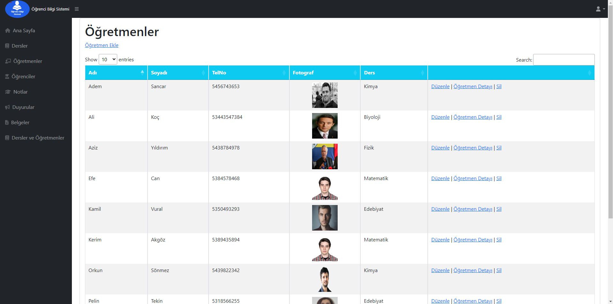

**Projenin Özellikleri:**
- ASP.NET Core 6.0
- Entity Framework Core
- Bootstrap
- SQL Server
- jQuery

<strong>Giriş Sayfası:</strong>

<strong>Ana Sayfa:</strong>

<strong>Dersler:</strong>

<strong>Öğretmenler:</strong>

<strong>Öğrenciler:</strong>

<strong>Notlar:</strong>

<strong>Duyurular:</strong>

<strong>Belgeler:</strong>

<strong>Dersler ve Öğretmenler:</strong>

<strong>Dersler ve Öğretmenler Örnek:</strong>

Beni desteklemek için projeyi yıldızlarsanız çok sevinirim. Teşekkürler.

I would greatly appreciate it if you could star the project to support me. Thank you!.

